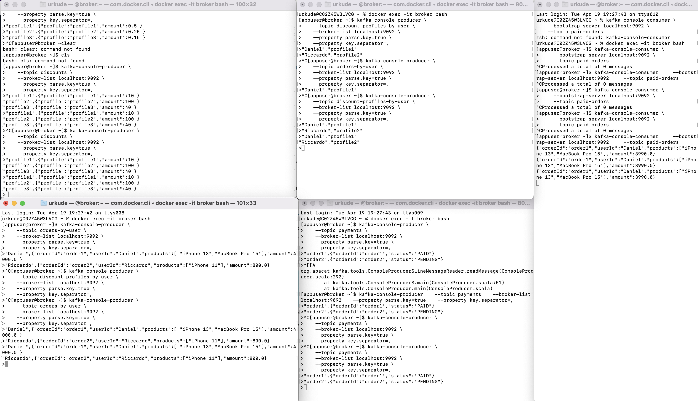

## KAFKA

- Kafka is a distributed event log. It enables you to publish and subscribe to message with different order and delivery guarantees.
- Producers push Messages into a particular Topic, and Consumers subscribe to this Topic to fetch and process the Messages
- Kafka treats each message as a sequence of bytes without imposing any structure or schema on the data. It’s up to clients to eventually interpret such bytes with a particular schema. Moreover, any message can have an associated key. The broker doesn’t decrypt the key in any way, as done for the message itself.
- The broker divides every topic into partitions, which are at the core of Kafka’s resiliency and scalability
- In fact, every partition stores only a subset of messages, divided by the broker using the hash of the message’s key. Partitions are distributed among the cluster of brokers, and they are replicated to guarantee high availability.

### Infrastructure side

- One or more Producers sending messages to the brokers. 
- One or more Kafka Brokers, the actual messaging server handling communication between producers and consumers. 
- One or more Consumers fetching and processing messages, in clusters named Consumer Groups. 
- One or more Zookeeper instances managing the brokers.
- (Optionally) One or more Registry instances uniformizing message schema.

### Concept of Apache Kafka clusters

- **Kafka zookeeper:** The brokers in a cluster are coordinated and managed by zookeepers. Zookeeper notifies producers and consumers about the presence of a new broker or failure of a broker in the Kafka system as well as notifies consumers about offset value. Producers and consumers coordinate their activities with another broker on receiving from the zookeeper. 
- **Kafka broker:** Kafka brokers are systems responsible for maintaining the published data in Kafka clusters with the help of zookeepers. A broker may have zero or more partitions for each topic.
- **Kafka producer:** The messages on one or more than one Kafka topics are published by the producer and pushed to brokers, without awaiting broker acknowledgement.
- **Kafka consumer:** Consumers extract data from the brokers and consume already published messages from one or more topics, issue a non-synchronous pull request to the broker to have a ready to consume buffer of bytes and then supplies an offset value to rewind or skip to any partition point.

### Fundamental concepts of Kafka architecture

- **Topics:** It is a logical channel to which messages are published by producers and from which messages are received by consumers. Topics can be replicated (copied) as well as partitioned (divided). A particular kind of message is published on a specific topic, with each topic identifiable by its unique name. 
- **Topic partitions:** In the Kafka cluster, topics are divided into partitions as well as replicated across brokers. A producer can add a key to a published message, and messages with the same key end up in the same partition. An incremental ID called offset is assigned to each message in a partition, and these IDs are valid only within the partition and have no value across partitions in a topic. 
- **Leader and replica:** Every Kafka broker has a few partitions with each partition, either being a leader or a replica (backup) of the topic. The leader is responsible for not only reading and writing to a topic but also updating the replicas with new data. If, in any case, the leader fails, the replica can take over as the new leader.

### Architecture of Apache Kafka


A Kafka having more than one broker is called a Kafka cluster. Four of the core APIs will be discussed in this Apache Kafka Tutorial:

- Producer API: The Kafka producer API allows a stream of records to be published by an application to one or several Kafka topics. 
- Consumer API: The consumer API allows an application to process the continuous flow of records produced to one or more topics. 
- Streams API: The streams API allows an application to consume an input stream from one or several topics and generate an output stream to one or several output topics, thus permitting the application to act as a stream processor. This efficiently modifies the input streams to the output streams. 
- Connector API: The connector API allows the creation and running of reusable producers and consumers, thus enabling a connection between Kafka topics and existing data systems or applications.

### Terminologies

- Serde - The Kafka Streams library uses the so-called Serde type.A Serde provides the logic to read and write a message from and to a Kafka topic.
- The builder lets us create the Stream DSL’s primary types, which are the KStream, KTable, and GlobalKTable types.
- `import org.apache.kafka.streams.scala.ImplicitConversions._` used for implicit conversion of object to Serde
- The Kafka Streams library also offers KTable and GlobalKTable, built both on top of a compacted topic. (hence `--config "cleanup policy=compact"`)
- Joining with a GlobalKTablePermalink needs keyValueMapper and joiner
 ```scala
def join[GK, GV, RV](globalKTable: GlobalKTable[GK, GV])(
  keyValueMapper: (K, V) => GK,
  joiner: (V, GV) => RV,
): KStream[K, RV]
```
- Joining KStreamsPermalink. Streams are continuously changing pieces of information, hence we must window the join between two streams `JoinWindows.of(Duration.of(5, ChronoUnit.MINUTES))`

### Key features of Kafka

Let’s take a look at some key features that make Kafka so popular:
- Scalability: Kafka manages scalability in event connectors, consumers, producers, and processors.
- Fault tolerance: Kafka is fault-tolerant and easily handles failures with masters and databases.
- Consistent: Kafka can scale across many servers and still maintain the ordering of your data.
- High performance: Kafka has high throughput and low latency. It remains stable even when working with a multitude of data.
- Extensibility: Many applications have integrations with Kafka.
- Replication capabilities: Kafka uses ingest pipelines and can easily replicate events.
- Availability: Kafka can stretch clusters over availability zones or connect different clusters across different regions. Kafka uses ZooKeeper to manage clusters.
- Connectivity: The Kafka Connect interface allows you to integrate with many event sources such as JMS and AWS S3.
- Community: Kafka is one of the most active projects in the Apache Software Foundation. The community holds events like the Kafka Summit by Confluent.

### Kafka Configuration

1. For starting docker container
```ignorelang
docker-compose up ## For starting docker container with zookeeper and kafka
```

2. Start docker bash in other terminal 
```ignorelang
docker exec -it broker bash
```

3. Create kafka topics
```ignorelang
kafka-topics --bootstrap-server broker:9092 --topic <topic> --create --replication-factor 1 --partitions 2
```

4. To create above Kafka command automatically for all topics use below code:
```scala
List("orders-by-user",
          "discount-profiles-by-user",
          "discounts",
          "orders",
          "payments",
          "paid-orders").foreach( topic => println(s"kafka-topics --bootstrap-server broker:9092 --topic ${topic} --create --replication-factor 1 --partitions 2"))
```

5. We have used circe to serialise and de-serialise Case Classes into JSON and then to bytes for Kafka to ingest.

### Console Script for Sourcing data

1. Create Topics
```ignorelang
kafka-topics \
  --bootstrap-server localhost:9092 \
  --topic orders-by-user \
  --create
  
kafka-topics \
  --bootstrap-server localhost:9092 \
  --topic discount-profiles-by-user \
  --create \
  --config "cleanup.policy=compact"
  
kafka-topics \
  --bootstrap-server localhost:9092 \
  --topic discounts \
  --create \
  --config "cleanup.policy=compact"
  
kafka-topics \
  --bootstrap-server localhost:9092 \
  --topic orders \
  --create
  
kafka-topics \
  --bootstrap-server localhost:9092 \
  --topic payments \
  --create
  
kafka-topics \
  --bootstrap-server localhost:9092 \
  --topic paid-orders \
  --create
```

2. Add data to Topics, Run in Different Consoles, Add all data at once while Application is running
```ignorelang
kafka-console-producer \
   --topic discounts \
   --broker-list localhost:9092 \
   --property parse.key=true \
   --property key.separator=,
<Hit Enter>
"profile1",{"profile":"profile1","amount":10 }
"profile2",{"profile":"profile2","amount":100 }
"profile3",{"profile":"profile3","amount":40 }

kafka-console-producer \
   --topic discount-profiles-by-user \
   --broker-list localhost:9092 \
   --property parse.key=true \
   --property key.separator=,
<Hit Enter>
"Daniel","profile1"
"Riccardo","profile2"

kafka-console-producer \
   --topic orders-by-user \
   --broker-list localhost:9092 \
   --property parse.key=true \
   --property key.separator=,
<Hit Enter>
"Daniel",{"orderId":"order1","userId":"Daniel","products":[ "iPhone 13","MacBook Pro 15"],"amount":4000.0 }
"Riccardo",{"orderId":"order2","userId":"Riccardo","products":["iPhone 11"],"amount":800.0}

kafka-console-producer \
   --topic payments \
   --broker-list localhost:9092 \
   --property parse.key=true \
   --property key.separator=,
<Hit Enter>
"order1",{"orderId":"order1","status":"PAID"}
"order2",{"orderId":"order2","status":"PENDING"}

kafka-console-consumer \
    --bootstrap-server localhost:9092 \
    --topic paid-orders
```

Output will look like:



3. Remove Topics
```ignorelang
kafka-topics --bootstrap-server broker:9092 --topic orders-by-user --delete
kafka-topics --bootstrap-server broker:9092 --topic discount-profiles-by-user --delete
kafka-topics --bootstrap-server broker:9092 --topic discounts --delete
kafka-topics --bootstrap-server broker:9092 --topic orders --delete
kafka-topics --bootstrap-server broker:9092 --topic payments --delete
kafka-topics --bootstrap-server broker:9092 --topic paid-orders --delete
```

### Kafka use cases

You can use Kafka in many ways, but here are some examples of different use cases shared on the official Kafka site:
- Processing financial transactions in real-time
- Tracking and monitoring transportation vehicles in real-time
- Capturing and analyzing sensor data
- Collecting and reacting to customer interactions
- Monitoring hospital patients
- Providing a foundation for data platforms, event-driven architectures, and microservices
- Performing large-scale messaging
- Serving as a commit-log for distributed systems

- [For Full Tutorial](https://www.youtube.com/watch?v=MYTFPTtOoLs&t=711s)
- [Blog Tutorial](https://blog.rockthejvm.com/kafka-streams/)
